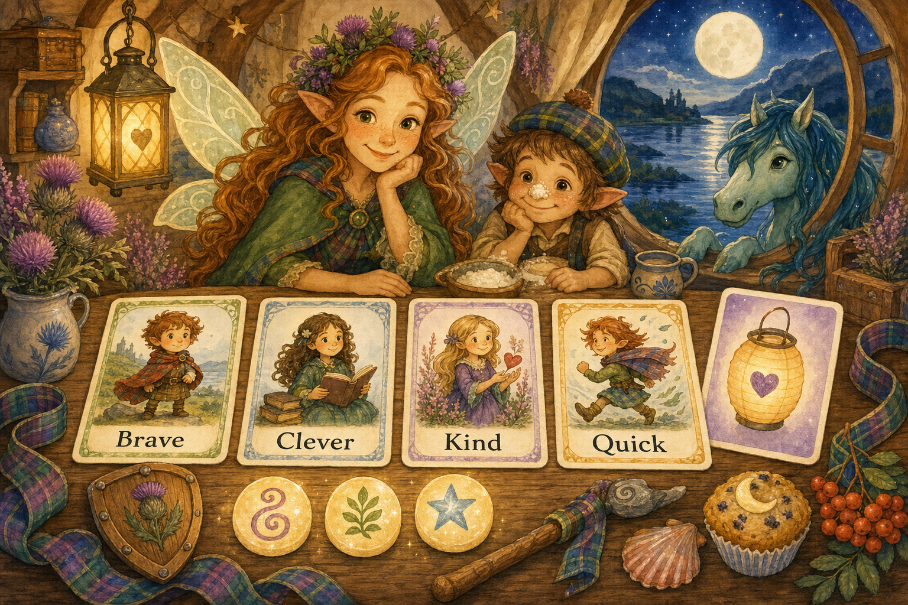

# Thistlebright Adventures — Dungeon Master Guide

## Your job as Guide
You are not trying to beat the children. You are helping them feel brave, clever, and kind. Keep the pace quick, the choices clear, and the tone magical.

## Session length
For ages 5–7, aim for **20–40 minutes**.
Use this structure:
1. **Wonder:** show a magical place.
2. **Problem:** someone needs help.
3. **Three scenes:** clue, obstacle, choice.
4. **Happy ending:** celebrate and give a sticker/title/treasure.

## Kid-safe stakes
Use lost things, mixed-up magic, grumpy creatures, riddles, weather trouble, broken bridges, and missing songs.
Avoid graphic injury, hopelessness, betrayal by trusted adults, punishing curiosity, and long tactical combat.

## The “Lantern” safety word
If a child says **Lantern**, immediately soften the scene. Example: “The dragon is not angry; it has hiccups and needs help.”

## Building encounters
Every encounter should have at least three solutions:
- **Kind:** comfort, negotiate, share.
- **Clever:** solve a riddle, spot a clue.
- **Brave/Quick:** climb, run, distract, protect.

## Gentle conflict goals
Calm it, help it, outwit it, return what was lost, or make a fair trade.

## Rewards
Use story rewards, not power creep: title, tiny treasure, helper, or a new place opens on the map.

## Running high fantasy for small children
- One big image per scene.
- One problem at a time.
- Repeat important clues three times.
- Let kids invent solutions. Say “yes, and” often.

## Quick NPC voices
- Scottish fairy: bright, playful, “Och, wee hero!”
- Brownie: busy, practical, loves tidy kitchens.
- Kelpies: musical, splashy, likes riddles.
- Dragon: booming but polite, sneezes smoke-rings.

## Example scene template
**Place:** Misty stepping stones over a silver burn.
**Need:** A fairy courier dropped moon-mail.
**Obstacle:** Stones move when nobody says please.
**Clues:** Wet envelopes, giggling reeds, hoofprints.
**Solutions:** Ask reeds kindly, leap quickly, sing to stones.
**Reward:** A moon-stamp that glows near secrets.

---

## Print-and-play Guide cards
Use these as quick table reminders. Cut them into cards or copy them onto index cards.

### Stat reminder cards
| Card | Say to the child | Good for |
|---|---|---|
| **Brave** | “You try something hard or stand up for a friend.” | climbing, protecting, facing a noisy-but-safe surprise |
| **Clever** | “You notice clues or make a plan.” | riddles, maps, remembering fairy stories |
| **Kind** | “You help someone feel better.” | calming, sharing, apologising, inviting |
| **Quick** | “You move fast or carefully.” | catching, sneaking, balancing, racing |

### Charm tokens
Give each hero 3 small tokens (buttons, shells, beads, or paper thistles). A hero may spend one to:
- reroll a die;
- add **+1** to a friend’s roll after saying how they help;
- ask for one gentle clue;
- make a scene softer by holding up the **Lantern** card.

### Twist cards for 3–4 results
When a roll is almost there, let the player pick or roll 1d6:
1. Your socks squeak loudly.
2. A tiny fairy starts narrating everything you do.
3. A tartan ribbon ties itself into a bow on your hat.
4. You succeed, but the clue is covered in biscuit crumbs.
5. A cloud sheep follows you for the rest of the scene.
6. Everyone must do one silly dance step before moving on.

### “Not yet” cards for 1–2 results
Avoid saying “you fail.” Try one of these:
- “Not yet — who can help you?”
- “That way is wobbly. What is a kinder or cleverer way?”
- “You learn one useful thing, but need a new plan.”
- “A funny complication appears; it is safe, just inconvenient.”

### Table comfort checklist
Before play, prepare:
- dice that are easy to see;
- pencils and blank spaces for drawing;
- one visible **Lantern** card;
- a 5-minute wiggle break option;
- a promise that every ending is safe, warm, and celebratory.
