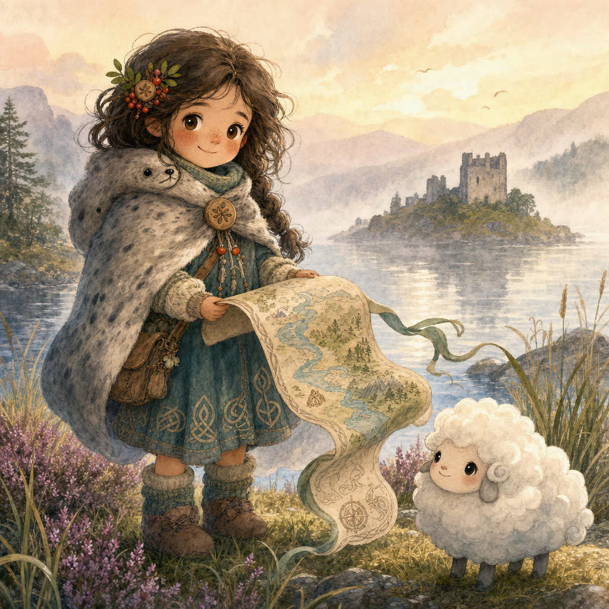

# Thistlebright Adventures — Player Handbook

> **For grown-up helpers:** This chapter is written to be read aloud. Pause at each “Your turn” box and let the child choose, point, draw, or answer with one word. A complete first character should take **5–10 minutes**.

## Welcome, wee hero

You are about to make a brave, clever, kind, quick hero for a fairy-tale adventure. Your hero does not need to be perfect. Your hero only needs three things:

1. A **name**.
2. A **way to help**.
3. A **little bit of magic or courage**.

---

## Chapter 1 — How the game feels

This is a talking, drawing, dice-rolling game. The Guide describes a magical place. You say what your hero tries. Then everyone helps tell what happens next.

The story is about:
- Finding lost things.
- Helping mixed-up creatures.
- Solving gentle puzzles.
- Being brave without being mean.
- Making the glen safer and happier.

### The Golden Rules
1. **Heroes help.** Kindness comes first.
2. **Everyone gets a turn.** Invite quiet friends in.
3. **Lantern makes it gentler.** If anything feels too spooky, say “Lantern!”
4. **A low roll means a new idea.** It never means you are bad at the game.

---

## Chapter 2 — The dice rule

When the Guide says, “That is tricky,” roll one six-sided die.

**Roll 1d6 + one stat.**

| Total | What happens | Say it like this |
|---:|---|---|
| **5 or more** | You do it! | “Yes! Tell us what it looks like.” |
| **3–4** | You do it, with a silly twist. | “Yes, but something funny happens.” |
| **1–2** | Not yet. Try a new plan or ask for help. | “Not yet. What else could we try?” |

### Your four stats
Use these when your hero does something tricky:

- **Brave** — climbing, protecting, trying a hard thing.
- **Clever** — puzzles, clues, remembering tales, making plans.
- **Kind** — calming creatures, sharing, apologizing, making peace.
- **Quick** — racing, catching, dodging, sneaking, balancing.

---

## Chapter 3 — Make a hero, step by step

In Thistlebright, a character has both a **race** and a **class**.

- Your **race** says what kind of fairy-tale person you are.
- Your **class** says what you like doing on adventures.

For ages 5–7, keep it simple: **pick one race, pick one class, then choose your numbers.**

---

### Step 1: Pick your race — your fairy-tale people

These are also called **kindreds** in the glen. Pick the one that sounds fun. Races do **not** make anyone better or worse. They give a tiny story gift and a way to imagine your hero.

#### Human Glenfolk
Curious children from villages, farms, islands, castles, and cozy cottages near the fairy roads.
- **Look:** tartan scarf, muddy boots, warm smile, pockets full of treasures.
- **Tiny gift:** Once per adventure, ask a grown-up, old sign, or village memory for a clue.
- **Good for players who want:** a familiar hero stepping into magic.

#### Fairy-Touched
Children with a little fairy sparkle: bright eyes, tiny wing-glimmers, or hair that floats when music plays.
- **Look:** thistle-petal shimmer, star freckles, ribbon-bright clothes.
- **Tiny gift:** Once per scene, notice nearby fairy magic.
- **Good for players who want:** sparkles, secrets, and fairy manners.

#### Brownie-Kin
Helpful wee folk who love fixing, tidying, baking, building, and making useful things.
- **Look:** flour on nose, tool pouch, apron, cozy cap.
- **Tiny gift:** Once per scene, repair, tidy, or improve one small thing.
- **Good for players who want:** practical problem-solving.

#### Selkie-Born
Gentle sea-hearted heroes with a soft seal-cloak, shell songs, or dreams of moonlit waves.
- **Look:** soft cloak, shell button, sea-glass charm, misty blue colors.
- **Tiny gift:** Once per scene, understand water, weather, or a sad feeling.
- **Good for players who want:** calm, kindness, and loch magic.

#### Rowan-Kin
Forest friends watched over by rowan trees, moss, birds, and old promises.
- **Look:** leaf crown, berry beads, mossy boots, bark-brown cloak.
- **Tiny gift:** Once per scene, ask a plant, tree, or bird for a small hint.
- **Good for players who want:** nature, guardianship, and gentle wisdom.

#### Dragon-Friend
A child blessed by a tiny friendly dragon: warm hands, smoke-ring giggles, or shiny scale freckles.
- **Look:** dragon-scale button, warm scarf, tiny harmless horn headband, smoky sparkles.
- **Tiny gift:** Once per adventure, make a little warm puff that dries, warms, or lights something safely.
- **Good for players who want:** brave wonder without scary fire.

> **Your turn:** Point to one race. Say, “I am a ______.”

---

### Step 2: Pick your class — your adventure job

Your class is what you do when adventure starts. It gives you one bigger **class gift**.

#### Thistle Knight
A tiny knight with a big heart.
- **Best at:** protecting friends and trying brave things.
- **Class gift:** Once per adventure, stand in front of danger and make it safe.
- **Starting item:** soft wooden shield.
- **Good name ideas:** Rowan, Tam, Isla Shieldbutton.

#### Glen Wizard
A young spell-speaker who knows rhyme-magic.
- **Best at:** small helpful magic and fairy clues.
- **Class gift:** Once per scene, make a small magical light, sound, or sparkle.
- **Starting item:** pebble wand.
- **Good name ideas:** Skye, Eilidh, Pip Pebblewand.

#### Loch Scout
A fast explorer who knows paths and animal tracks.
- **Best at:** maps, hidden paths, and quick movement.
- **Class gift:** Once per scene, find a hidden path or clue.
- **Starting item:** ribbon map.
- **Good name ideas:** Mairi, Finlay, Nessa Map-Button.

#### Hearth Bard
A singer, dancer, joker, and friend-maker.
- **Best at:** cheering people up and making grumpy creatures laugh.
- **Class gift:** Once per adventure, turn grumpiness into giggles.
- **Starting item:** tiny bell or whistle.
- **Good name ideas:** Brodie, Callum, Heather Bell.

#### Fairy Friend
A child-sized friend of the fairy courts.
- **Best at:** nature hints and fairy manners.
- **Class gift:** Once per scene, ask a small nature spirit for a hint.
- **Starting item:** acorn cup.
- **Good name ideas:** Ailsa, Lorna, Thistle Pip.

> **Your turn:** Point to one class. Say, “My job is ______.”

---

### Step 3: Put race + class together

Say both pieces together:

> “I am a **[race] [class]**.”

Examples:
- Human Glenfolk Thistle Knight
- Fairy-Touched Glen Wizard
- Brownie-Kin Hearth Bard
- Selkie-Born Loch Scout
- Rowan-Kin Fairy Friend
- Dragon-Friend Thistle Knight

### Step 4: Pick your numbers
Write these numbers next to your stats:

**+2, +1, +1, +0**

Put **+2** next to the thing your class is best at.

| If your class is... | Put +2 in... | Why |
|---|---|---|
| Thistle Knight | Brave | You protect and try hard things. |
| Glen Wizard | Clever | You know rhymes, signs, and tiny spells. |
| Loch Scout | Quick | You move fast and find paths. |
| Hearth Bard | Kind | You cheer people up. |
| Fairy Friend | Kind or Clever | You know fairy manners and nature hints. |

Then put **+1** in two other stats, and **+0** in the last one.

> **Grown-up helper tip:** The race gift is for flavor and tiny story help. The class tells the child what they are likely to do most often.

### Step 5: Pick a treasure
Choose one, roll 1d6, or invent something small:

1. Rowan button that feels warm near kind magic.
2. Tartan ribbon that points toward music.
3. Smooth loch pebble that skips once on any puddle.
4. Thistle badge that glows when someone is brave.
5. Heather biscuit wrapped in leaf-paper.
6. Wee wooden dragon that sneezes sparkles.

### Step 6: Answer one helper question
Finish this sentence:

**“My hero always helps __________________.”**

Ideas: lost animals, shy friends, grumpy creatures, little siblings, travelers, trees, dragons, anyone who is scared.

### Step 7: Draw your hero
Draw a big shape first. Then add:
- One sign of your **race**.
- One sign of your **class**.
- One tartan thing.
- One magical thing.
- One friendly smile.
- One tiny treasure.

---

## Chapter 4 — Full example character creation

Here is a complete example you can copy before making your own.

### Meet Mairi Map-Button

**Grown-up:** “What kind of hero sounds fun?”

**Player:** “I want to find secret paths and be from the loch.”

**Grown-up:** “Great. For race, Selkie-Born gives you gentle loch magic. For class, Loch Scout helps you find secret paths.”

#### 1. Race
Mairi chooses **Selkie-Born**. Her tiny race gift lets her understand water, weather, or a sad feeling once per scene.

#### 2. Class
Mairi chooses **Loch Scout**. Her class gift lets her find a hidden path or clue once per scene.

#### 3. Stats
A Loch Scout is best at moving fast and finding paths, so Mairi puts **+2 in Quick**.

Then she chooses:
- **Brave +1** because she likes crossing stepping stones.
- **Clever +1** because she likes maps.
- **Kind +0** because she is still learning how to talk to grumpy creatures.

Mairi’s stats are:

| Stat | Number |
|---|---:|
| Brave | +1 |
| Clever | +1 |
| Kind | +0 |
| Quick | +2 |

#### 4. Treasure
Mairi picks a **rowan button** sewn onto her scarf. It feels warm near kind magic.

#### 5. Helper sentence
Mairi writes:

**“My hero always helps lost travelers.”**

#### 6. Gifts
Because she is **Selkie-Born**, once per scene Mairi can understand water, weather, or a sad feeling.

Because she is a **Loch Scout**, once per scene Mairi can find a hidden path or clue.

### Mairi’s first roll
The Guide says:

> “A sleepy troll has lost his lullaby. The stepping stones wiggle in the moonlight. What do you do?”

Mairi says:

> “I look for tiny wet footprints to see where the lullaby went.”

That is a **Clever** roll. Mairi rolls a **4** and adds **+1 Clever**.

**4 + 1 = 5. Success!**

The Guide says:

> “You find silver footprints leading to a mossy cookie plate. The troll smiles and whispers, ‘Och, I remember the first line now.’”

---

## Chapter 5 — Charms and helping friends

Each hero starts with **3 charms**.

Spend one charm to:
- Reroll a die.
- Help a friend add **+1**.
- Make a scene less scary.
- Remember a helpful tale.

### How helping works
When a friend rolls, you can help by saying one clear action:
- “I hold the lantern so they can see.”
- “I share my scarf with the chilly kelpie.”
- “I remember the fairy rhyme with them.”

Then spend 1 charm to give your friend **+1**. If the roll still does not work, everyone learns something useful and tries a new idea.

---

## Chapter 6 — Tiny spells

Tiny spells never hurt anyone and never solve a whole adventure by themselves. They are best for making clues easier to see, cheering someone up, decorating a scene, or doing one small impossible thing.

| Spell | What it does |
|---|---|
| **Glowbug Light** | A soft glow floats near your hand. |
| **Tickly Breeze** | A gentle wind moves leaves, hair, or dust. |
| **Door-Knock Whisper** | A door politely tells you if it wants a knock. |
| **Puddle Mirror** | A puddle shows the last kind thing said nearby. |
| **Tartan Sparkle** | A ribbon sparkles when fairy magic is close. |
| **Feather Fall** | Someone lands softly on moss or feathers. |
| **Mossy Cushion** | Soft moss appears where someone might tumble. |
| **Heather Hello** | Flowers wave toward a friendly creature. |
| **Rowan Promise** | A leaf glows when someone tells the truth. |
| **Ceilidh Beat** | A tap-tap rhythm helps everyone march together. |

---

## Chapter 7 — Example play scene

**Guide:** “The bridge is guarded by a sleepy troll who lost his lullaby.”

**Player:** “I sing him a soft song.”

**Guide:** “That sounds Kind. Roll one die and add Kind.”

**Player:** “I rolled a 4. My Kind is +1. That makes 5!”

**Guide:** “You do it! The troll smiles, yawns, and lets you cross. He gives you a moss cookie for later.”

### A turn in three steps
1. **Say what you try.** “I ask the brownie what is wrong.”
2. **Choose the best stat.** Kind, Clever, Brave, or Quick.
3. **Roll and tell the story.** On a twist, make it funny: squeaky boots, floating hair, biscuit crumbs, or a frog clapping.

---

## Chapter 8 — What heroes do not do

Thistlebright heroes do not use gore, cruel tricks, or permanent harm. Even “monsters” are usually hungry, lonely, mixed-up, sleepy, cursed by silly magic, or guarding the wrong thing.

The best victory is:
- A new friend.
- A fair trade.
- A safe path home.
- A creature feeling understood.
- A party under the rowan tree.
