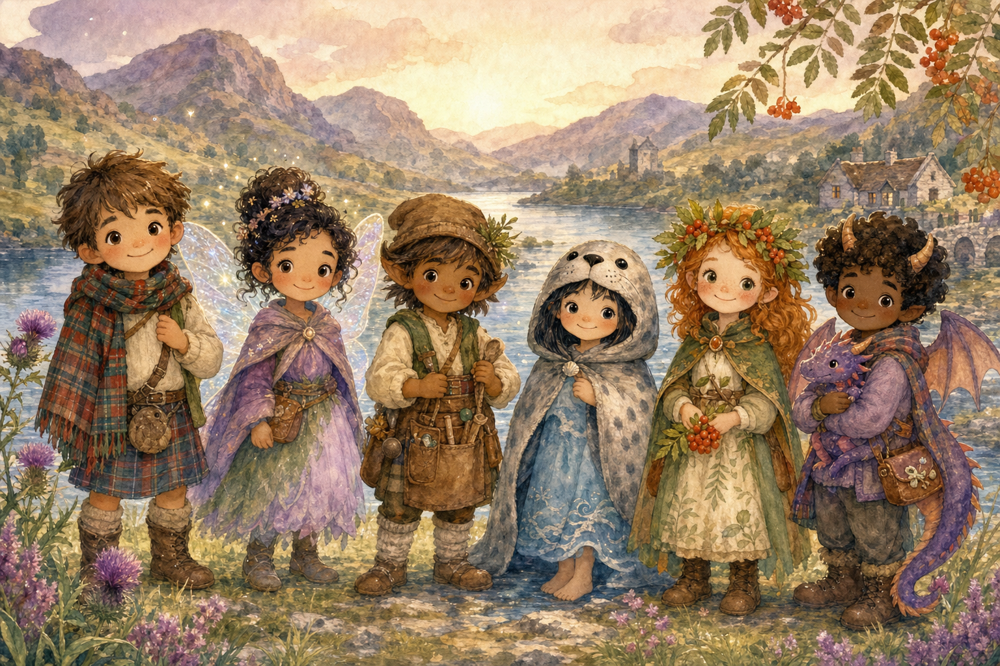
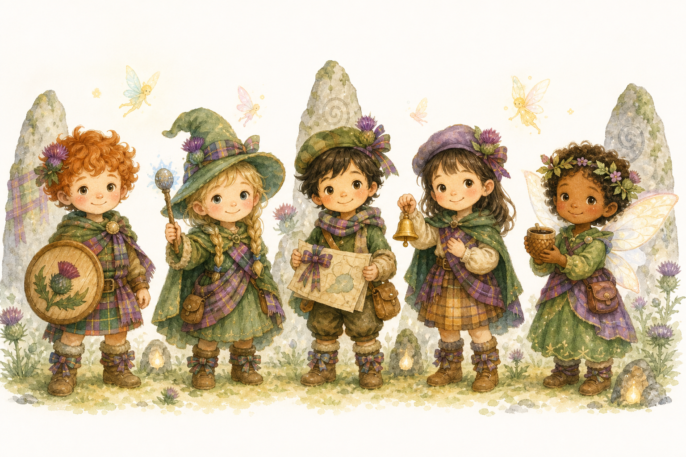

# Player Races and Classes Quick Reference

## Races / Kindreds

| Race | Tiny story gift | Visual idea |
|---|---|---|
| Human Glenfolk | Once per adventure, ask a grown-up, old sign, or village memory for a clue. | tartan scarf, muddy boots, pockets full of treasures |
| Fairy-Touched | Once per scene, notice nearby fairy magic. | star freckles, thistle shimmer, ribbon-bright clothes |
| Brownie-Kin | Once per scene, repair, tidy, or improve one small thing. | apron, tool pouch, flour on nose |
| Selkie-Born | Once per scene, understand water, weather, or a sad feeling. | seal-cloak scarf, shell button, sea-glass charm |
| Rowan-Kin | Once per scene, ask a plant, tree, or bird for a small hint. | leaf crown, berry beads, mossy boots |
| Dragon-Friend | Once per adventure, make a little warm puff that dries, warms, or lights something safely. | scale freckles, warm scarf, smoky sparkles |

## Classes / Paths

| Class | Best stat | Class gift | Starting item |
|---|---|---|---|
| Thistle Knight | Brave | Once per adventure, stand in front of danger and make it safe. | soft wooden shield |
| Glen Wizard | Clever | Once per scene, make a small magical light, sound, or sparkle. | pebble wand |
| Loch Scout | Quick | Once per scene, find a hidden path or clue. | ribbon map |
| Hearth Bard | Kind | Once per adventure, turn grumpiness into giggles. | tiny bell or whistle |
| Fairy Friend | Kind or Clever | Once per scene, ask a small nature spirit for a hint. | acorn cup |

## Fast formula

**I am a [race] [class] who helps [someone].**

Examples:
- I am a **Selkie-Born Loch Scout** who helps lost travelers.
- I am a **Brownie-Kin Hearth Bard** who helps grumpy creatures.
- I am a **Dragon-Friend Thistle Knight** who helps anyone who feels scared.
