# Player Races and Classes Quick Reference

## Races / Kindreds

### Human Glenfolk
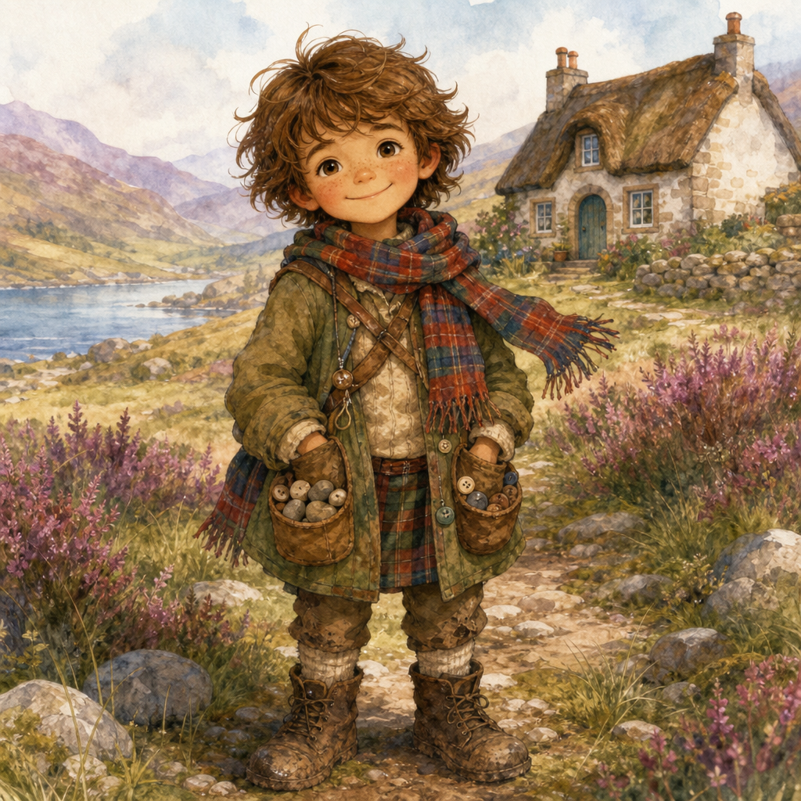
- **Tiny story gift:** Once per adventure, ask a grown-up, old sign, or village memory for a clue.
- **Visual idea:** tartan scarf, muddy boots, pockets full of treasures.

### Fairy-Touched
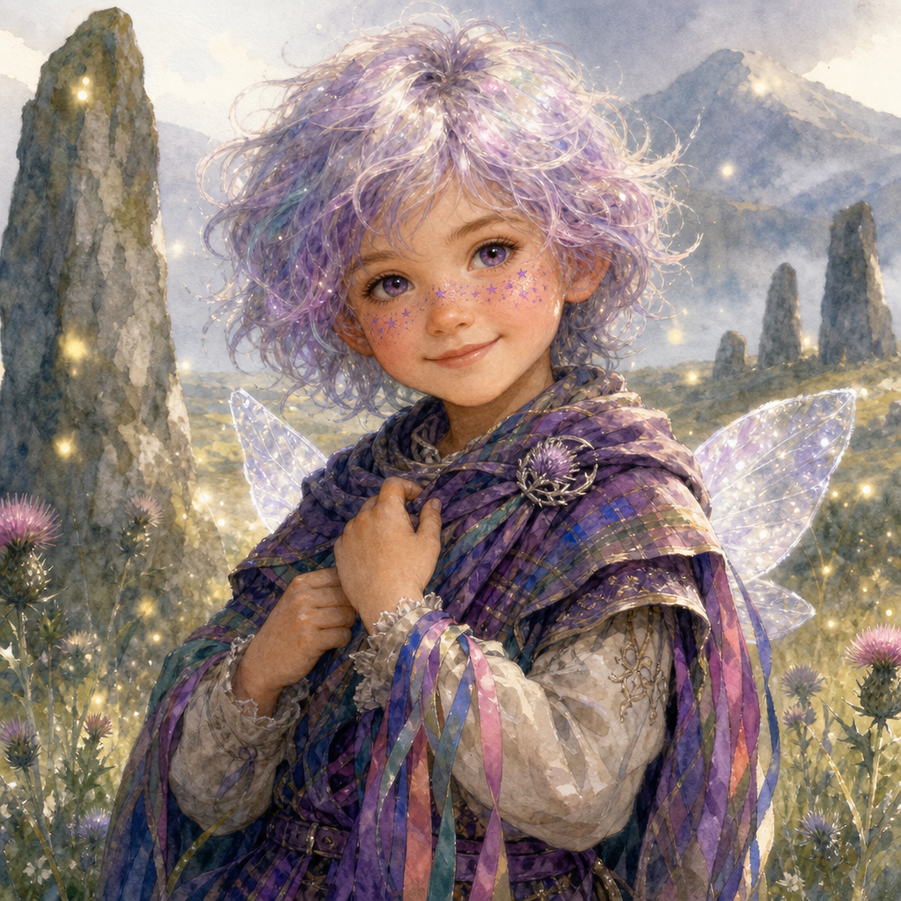
- **Tiny story gift:** Once per scene, notice nearby fairy magic.
- **Visual idea:** star freckles, thistle shimmer, ribbon-bright clothes.

### Brownie-Kin
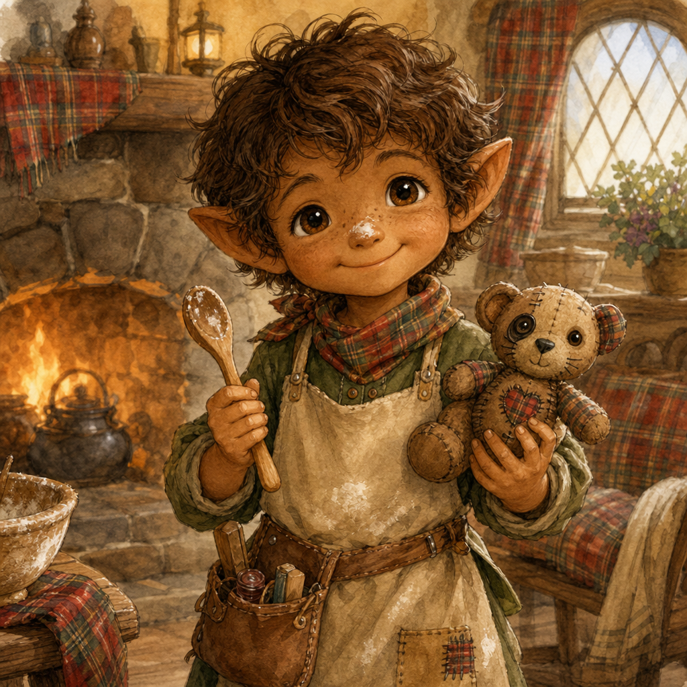
- **Tiny story gift:** Once per scene, repair, tidy, or improve one small thing.
- **Visual idea:** apron, tool pouch, flour on nose.

### Selkie-Born
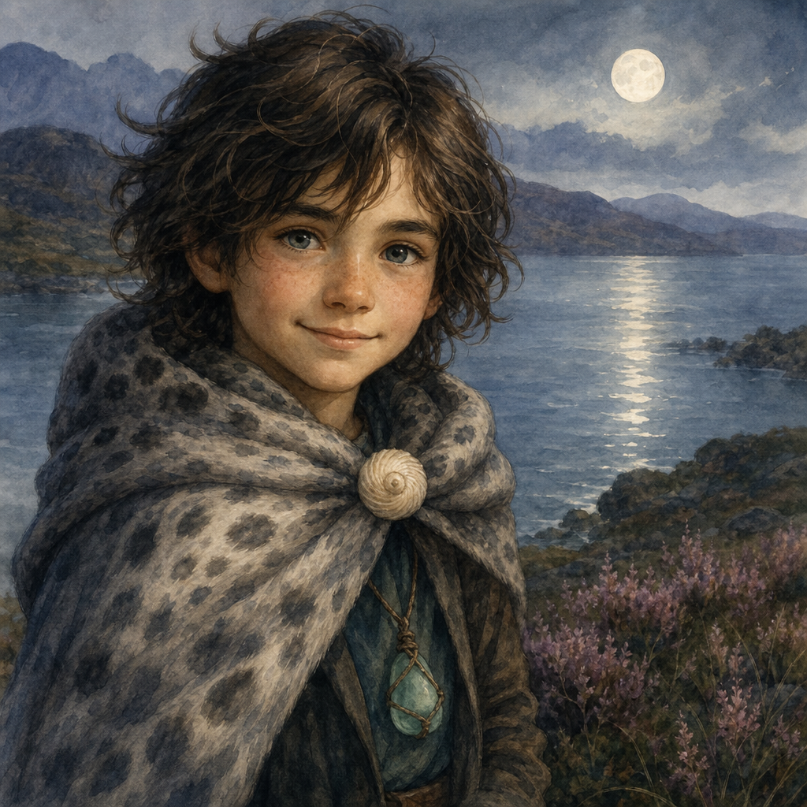
- **Tiny story gift:** Once per scene, understand water, weather, or a sad feeling.
- **Visual idea:** seal-cloak scarf, shell button, sea-glass charm.

### Rowan-Kin
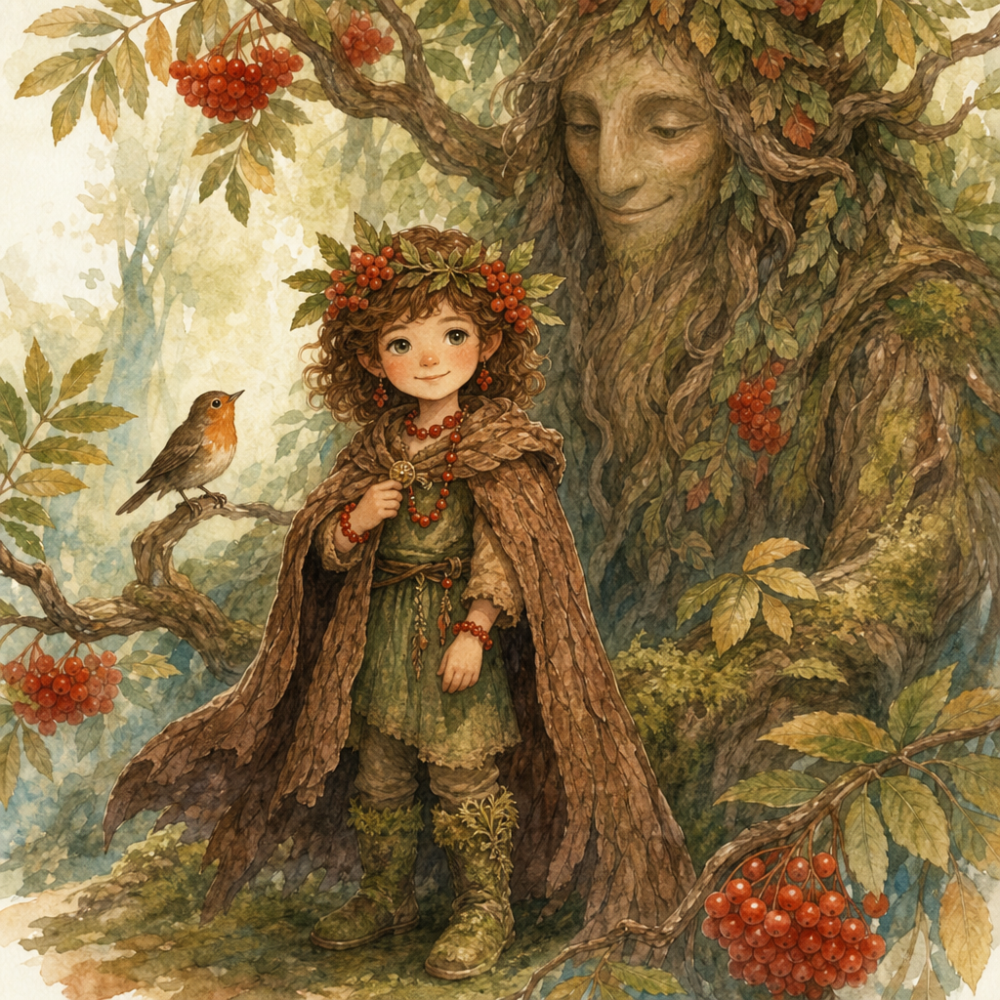
- **Tiny story gift:** Once per scene, ask a plant, tree, or bird for a small hint.
- **Visual idea:** leaf crown, berry beads, mossy boots.

### Dragon-Friend
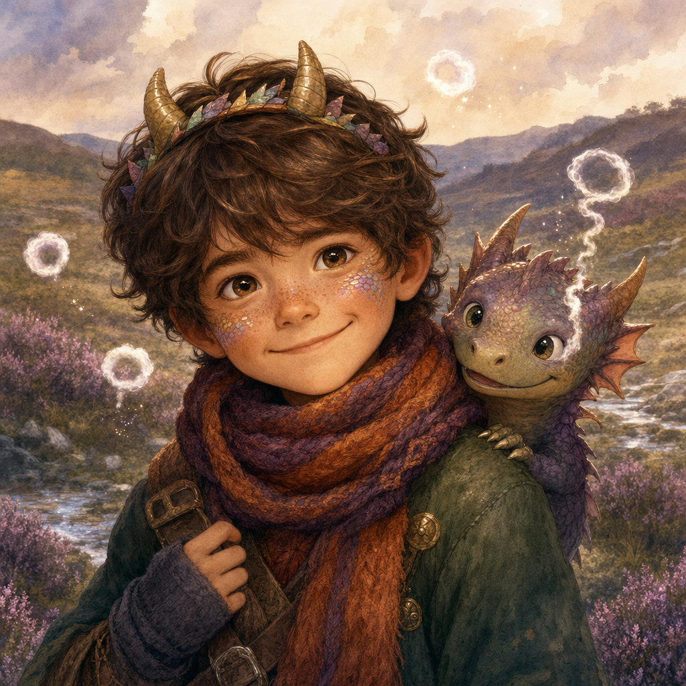
- **Tiny story gift:** Once per adventure, make a little warm puff that dries, warms, or lights something safely.
- **Visual idea:** scale freckles, warm scarf, smoky sparkles.

## Classes / Paths

### Thistle Knight
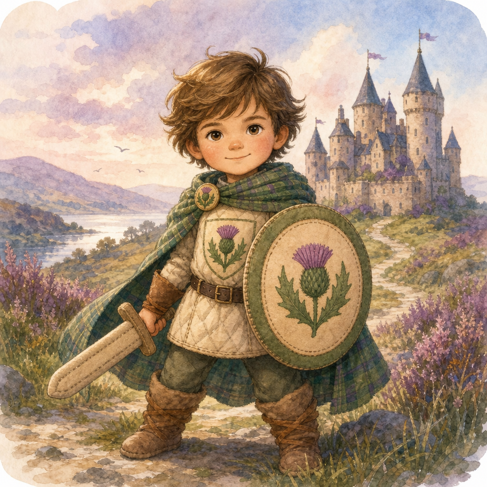
- **Best stat:** Brave
- **Class gift:** Once per adventure, stand in front of danger and make it safe.
- **Abilities:** Shield of Thistles; Brave Step; Kind Challenge; Lantern Guard.

### Glen Wizard
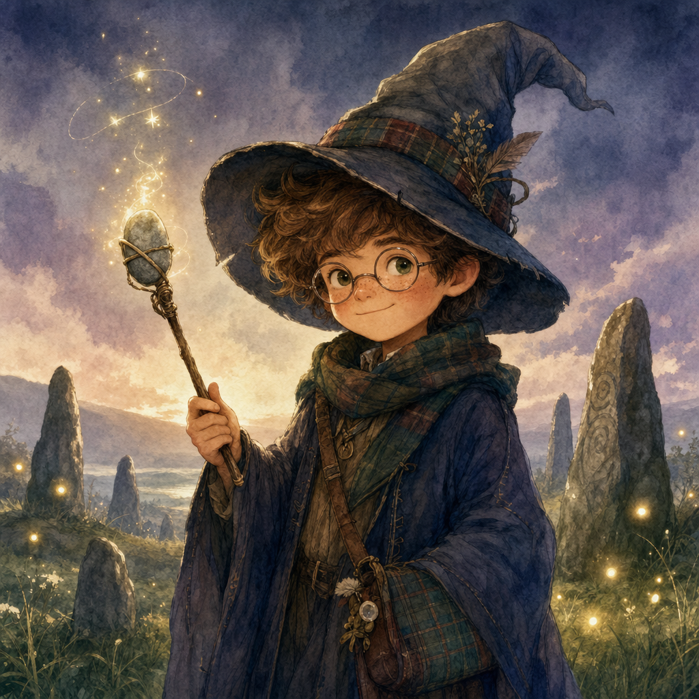
- **Best stat:** Clever
- **Class gift:** Once per scene, make a small magical light, sound, or sparkle.
- **Spells:** Glowbug Light; Pebble Ping; Rhyme Reminder; Sparkle Signal.

### Loch Scout
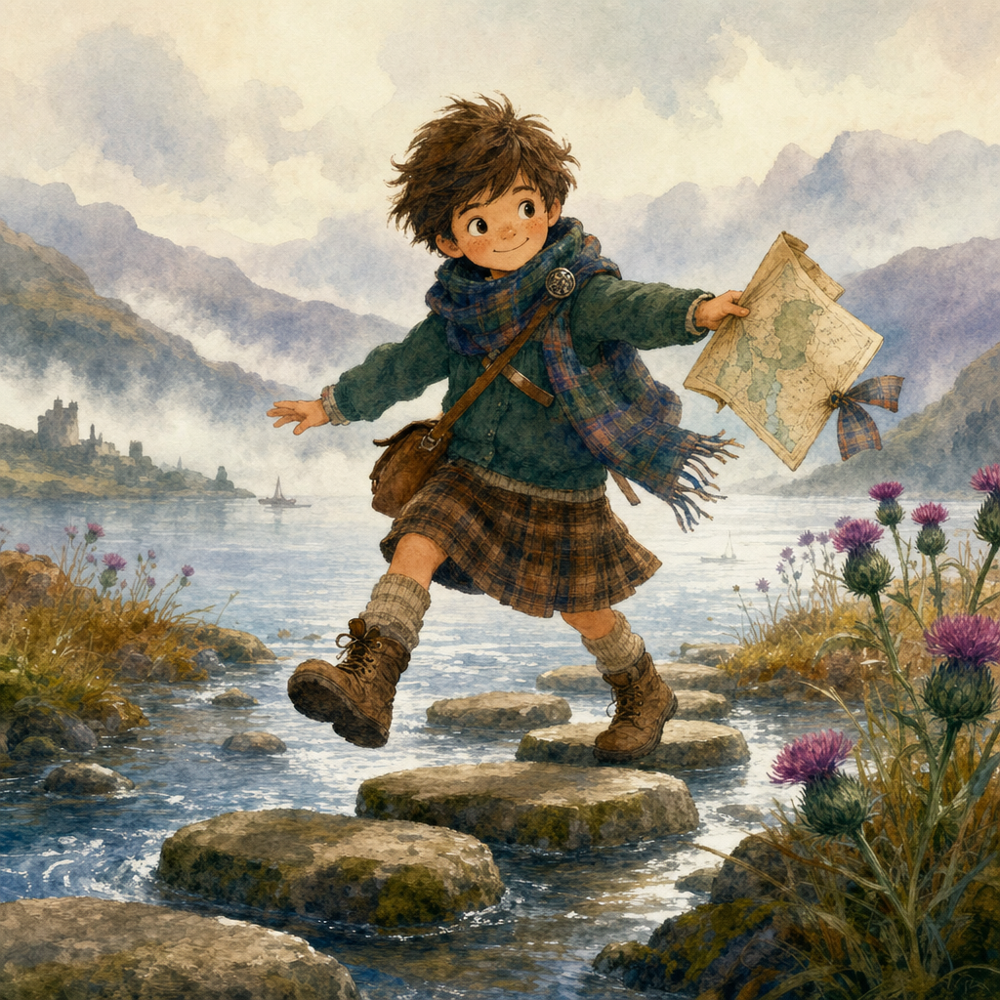
- **Best stat:** Quick
- **Class gift:** Once per scene, find a hidden path or clue.
- **Abilities:** Ribbon Map; Quiet Boots; Stepping-Stone Hop; Trail Friend.

### Hearth Bard
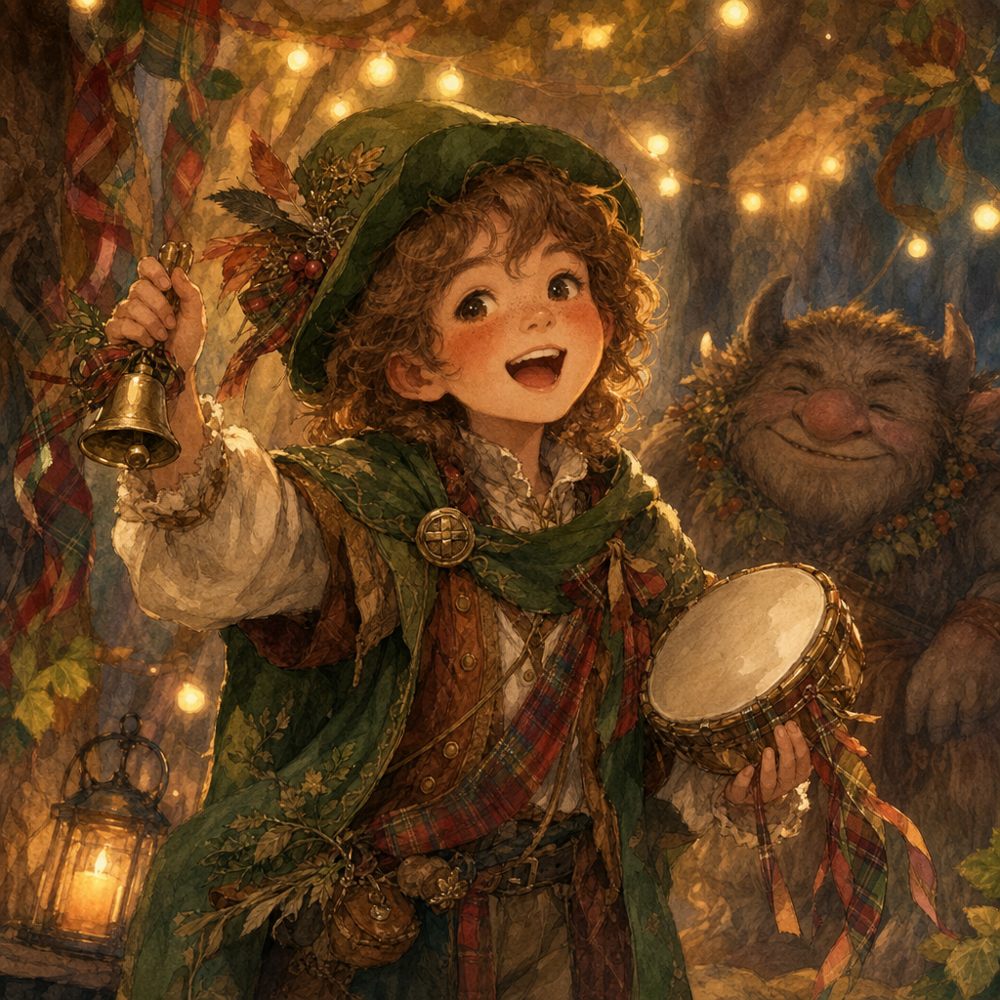
- **Best stat:** Kind
- **Class gift:** Once per adventure, turn grumpiness into giggles.
- **Spells:** Ceilidh Beat; Giggle Verse; Warm Welcome; Encore Help.

### Fairy Friend
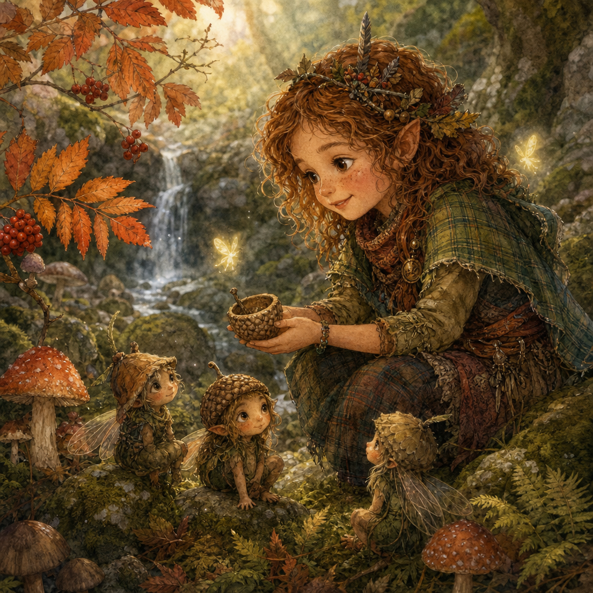
- **Best stat:** Kind or Clever
- **Class gift:** Once per scene, ask a small nature spirit for a hint.
- **Spells:** Acorn Cup; Heather Hello; Polite Promise; Mushroom Messenger.

## Fast formula

**I am a [race] [class] who helps [someone].**

Examples:
- I am a **Selkie-Born Loch Scout** who helps lost travelers.
- I am a **Brownie-Kin Hearth Bard** who helps grumpy creatures.
- I am a **Dragon-Friend Thistle Knight** who helps anyone who feels scared.
